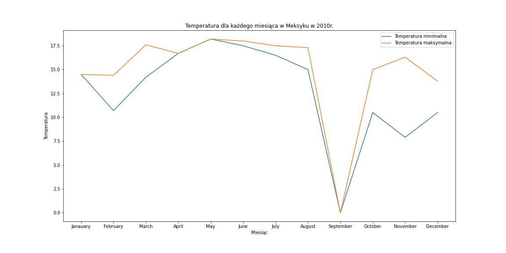

# Załącznik do danych
Wszystkie pliki z /AnalysisData/ opisane tutaj.

## weather.txt
Zmienne:
- TMIN - temperatura minimalna
- TMAX - temperatura maksymalna
- PRCP - ilość opadów atmosferycznych

**Szczegóły**

## weather_processed.csv
Ten plik zawiera skumulowane i przefiltrowane informacje z pliku weather.txt